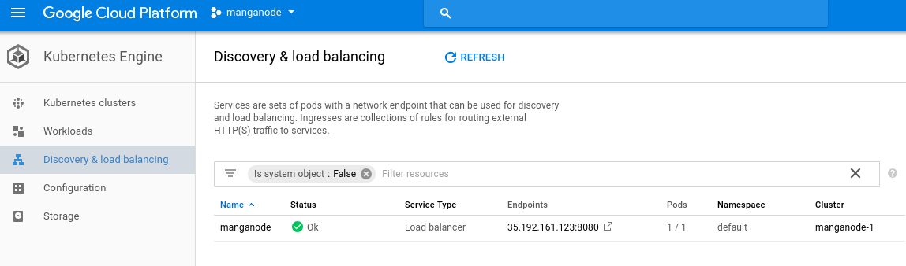
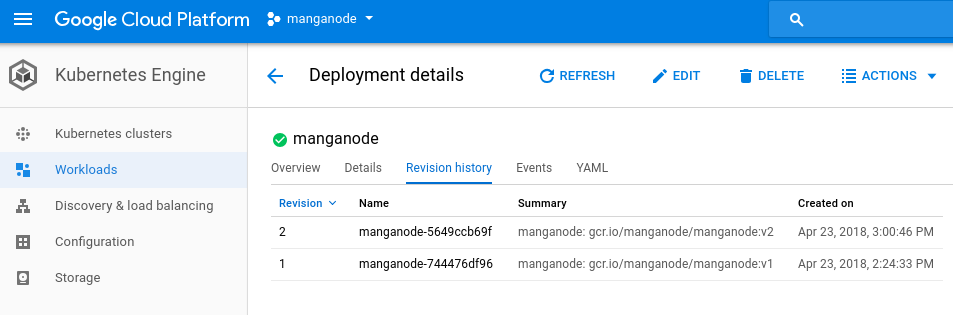

# google-cloud-kubernetes-manga

```bash
#setup
$HOME/MANGA/manganode
gcloud auth list
gcloud config list
gcloud info
gcloud projects list

#pruning
docker rm $(docker ps -a -q)
docker container prune

#delete the image
docker rmi manga

#build/rebuild the image
docker build -t manga .

docker run --name=manga -it -d -p 8080:8080 manga

#Up to this point the docker image has been built and works locally.
```


```bash
#Let's send the image to Google:
# ----  GOOGLE -----

gcloud auth configure-docker #sets up docker push
gcloud config set project manganode
docker build -t gcr.io/manganode/manganode:v1 .
docker run -d -p 8080:8124 gcr.io/manganode/manganode:v1
docker push gcr.io/manganode/manganode:v1

```
```bash
#configure Kubernetes
#---- KUBERNETES ----
#

gcloud container clusters get-credentials manganode-1 --zone us-central1-a --project manganode

kubectl run manganode --image gcr.io/manganode/manganode:v1 --port 8080

```
Login to the GUI to see the default setup:

 
```bash
kubectl get pods
kubectl logs manganode-744476df96-852kx
kubectl cluster-info
kubectl get events
kubectl config view
```

```bash
kubectl expose deployment manganode --type="LoadBalancer"
```


Click in the EndPoints to test your app

Now, time to push an update...

```bash
#Push update to the docker image
#Changed the app port to 8080, had a typo in the first version.
 
kubectl set image deployment/manganode manganode=gcr.io/manganode/manganode:v2

gcloud components update
kubectl rollout status deployment manganode


```



